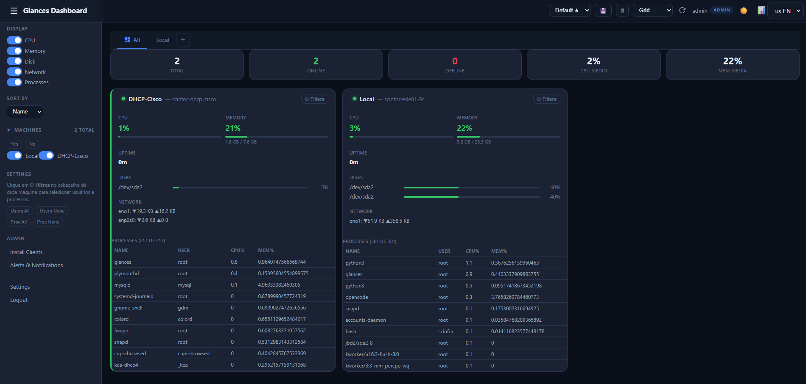

# Glances Dashboard


A web monitoring dashboard for [Glances](https://nicolargo.github.io/glances/) with multi-machine support, alerts, backups, and internationalization.

---

## Features

- **Real-time dashboard** — CPU, memory, disk, network, and processes
- **Multiple templates** — Grid, list, cards, and compact views
- **Multi-machine monitoring** — Monitor multiple Glances servers simultaneously
- **Alert system** — SMTP (email) and Telegram with configurable thresholds
- **Periodic monitoring** — Automatic data collection with charts
- **Backup & restore** — Full database export/import with ZIP download
- **Advanced filters** — By machine, date, status, and processes
- **Access control** — Admin and viewer users with profiles
- **Internationalization** — Portuguese and English
- **Themes** — Dark (default) and Light
- **Client installation guide** — Complete guide for installing Glances on clients
- **Web-based configuration** — Everything configurable through the interface

---

## Prerequisites

- Python 3.10+
- [Glances](https://nicolargo.github.io/glances/) with web API enabled (`glances -w`)
- pip3

---

## Quick Install

```bash
cd /var/www
git clone https://github.com/renanvignato-tech/dashboard-glances.git
cd dashboard-glances
chmod +x install.sh
./install.sh
```

Access: `http://YOUR_IP:8099`

Default login: **admin** / **admin**

---

## Manual Install

### 1. Clone the repository

```bash
git clone https://github.com/renanvignato-tech/dashboard-glances.git
cd dashboard-glances
```

### 2. Install dependencies

```bash
pip3 install -r requirements.txt
```

### 3. Initialize the database

```bash
python3 -c "from app.database import init_db; init_db()"
```

### 4. Configure systemd services

```bash
# Copy service files
sudo cp glances-web.service /etc/systemd/system/
sudo cp glances-dashboard.service /etc/systemd/system/

# Reload and start
sudo systemctl daemon-reload
sudo systemctl enable glances-web glances-dashboard
sudo systemctl start glances-web glances-dashboard
```

### 5. Verify

```bash
sudo systemctl status glances-dashboard
```

---

## Installing Glances on Clients

To monitor remote machines, Glances must be running on them with the web API enabled.

### Linux (Ubuntu/Debian)

```bash
# Install Glances
pip3 install glances[web]

# Create systemd service
sudo tee /etc/systemd/system/glances-web.service > /dev/null <<EOF
[Unit]
Description=Glances Web Interface
After=network.target

[Service]
Type=simple
ExecStart=/bin/bash -c 'hash -r && glances -w'
Restart=always
RestartSec=5
Environment=GLANCES_BIND=0.0.0.0

[Install]
WantedBy=multi-user.target
EOF

# Start
sudo systemctl daemon-reload
sudo systemctl enable glances-web
sudo systemctl start glances-web
```

### Linux (CentOS/RHEL)

```bash
pip3 install glances[web]

# Follow the same systemd service steps as Ubuntu
```

### Windows

```powershell
# Install Python and Glances
winget install Python.Python.3.12
pip install glances[web]

# Create service
sc.exe create GlancesWeb binPath= "python -m glances -w" start= auto
sc.exe start GlancesWeb
```

### Docker

```bash
docker run -d --name glances -p 61208:61208 -v /var/run/docker.sock:/var/run/docker.sock:ro docker.io/nicolargo/glances:latest-full -w
```

---

## Firewall

Ports **8099** (Dashboard) and **61208** (Glances) must be open.

### UFW (Ubuntu)

```bash
sudo ufw allow 8099/tcp
sudo ufw allow 61208/tcp
sudo ufw reload
```

### firewalld (CentOS)

```bash
sudo firewall-cmd --permanent --add-port=8099/tcp
sudo firewall-cmd --permanent --add-port=61208/tcp
sudo firewall-cmd --reload
```

### Windows

```powershell
netsh advfirewall firewall add rule name="Glances Dashboard" dir=in action=allow protocol=TCP localport=8099
netsh advfirewall firewall add rule name="Glances Web" dir=in action=allow protocol=TCP localport=61208
```

---

## Dashboard Preview



---

## Configuration

### Environment Variables

| Variable | Default | Description |
|----------|---------|-------------|
| `GLANCES_DASH_SECRET` | `glances-dashboard-secret-key-change-in-production` | JWT secret key (**change in production!**) |

### `config.py`

```python
SECRET_KEY = os.getenv("GLANCES_DASH_SECRET", "your-secret-here")
ACCESS_TOKEN_EXPIRE_MINUTES = 480  # 8 hours
GLANCES_DEFAULT_PORT = 61208
```

---

## Project Structure

```
dashboard-glances/
├── app/
│   ├── main.py              # FastAPI app + routes
│   ├── database.py           # SQLAlchemy models
│   ├── auth.py               # JWT + bcrypt
│   ├── i18n/                 # Internationalization
│   │   ├── pt.json
│   │   └── en.json
│   ├── routers/
│   │   ├── auth.py           # Login, register, password
│   │   ├── machines.py       # Machine CRUD
│   │   ├── dashboard.py      # Layouts + data
│   │   ├── backup.py         # Backup/restore
│   │   ├── monitor.py        # Monitoring + logs
│   │   ├── system.py         # System config
│   │   ├── logo.py           # Logo upload
│   │   └── alerts.py         # SMTP/Telegram alerts
│   ├── services/
│   │   ├── glances.py        # Glances HTTP client
│   │   ├── monitor.py        # Collection scheduler
│   │   └── backup.py         # Backup logic
│   └── templates/            # Jinja2 templates
│       ├── dashboard.html
│       ├── login.html
│       ├── settings.html
│       ├── logs.html
│       ├── admin_setup.html
│       ├── admin_alerts.html
│       ├── profile.html
│       └── email/            # Email templates
├── static/
│   ├── css/style.css
│   ├── js/
│   │   ├── dashboard.js
│   │   ├── settings.js
│   │   ├── logs.js
│   │   └── i18n.js
│   └── img/default.svg
├── config.py
├── requirements.txt
├── install.sh
├── glances-dashboard.service
└── glances-web.service
```

---

## API Endpoints

| Method | Route | Description |
|--------|-------|-------------|
| POST | `/api/auth/login` | Login |
| POST | `/api/auth/register` | Register user (admin) |
| GET | `/api/machines/` | List machines |
| POST | `/api/machines/` | Add machine |
| GET | `/api/dashboard/all-data` | All machines data |
| GET | `/api/monitor/config` | Monitor config |
| PUT | `/api/monitor/config` | Update config |
| GET | `/api/monitor/logs` | Monitor logs |
| POST | `/api/backup/create` | Create backup |
| GET | `/api/backup/list` | List backups |
| GET | `/api/backup/download?name=...` | Download backup (ZIP) |
| POST | `/api/backup/restore` | Restore backup |

---

## Management

```bash
# Status
sudo systemctl status glances-dashboard

# Restart
sudo systemctl restart glances-dashboard

# Real-time logs
sudo journalctl -u glances-dashboard -f

# Stop
sudo systemctl stop glances-dashboard
```

---

## License

MIT License - see [LICENSE](LICENSE) for details.

---

## Contributing

1. Fork the project
2. Create a branch (`git checkout -b feature/new-feature`)
3. Commit your changes (`git commit -m 'Add new feature'`)
4. Push to the branch (`git push origin feature/new-feature`)
5. Open a Pull Request

---

## Credits

- [Glances](https://nicolargo.github.io/glances/) — System monitoring tool
- [FastAPI](https://fastapi.tiangolo.com/) — Web framework
- [SQLAlchemy](https://www.sqlalchemy.org/) — ORM
